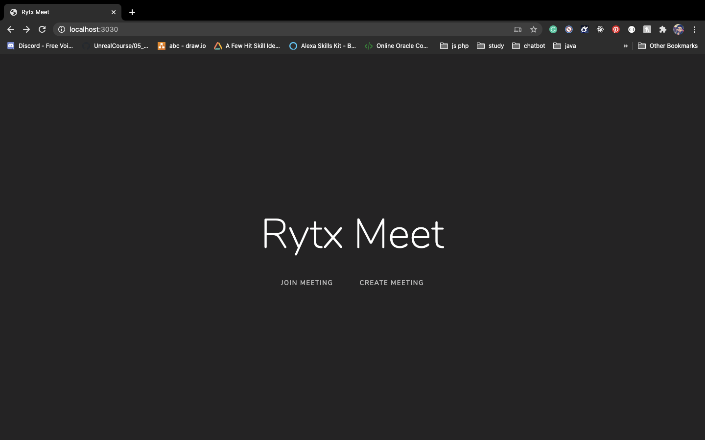
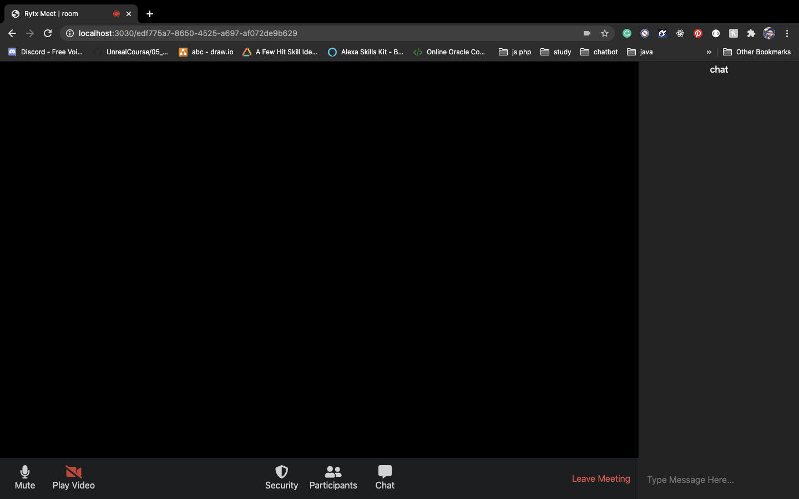

# plan of action

- Initialize our nodejs project DONE
- Initialize our first view DONE
- Create a room id DONE
- Add the ability our own video DONE
- Add ability to all others to stream their video DONE
- Add styling DONE
- Add ability to create msgs DONE
- Add mute button DONE
- Add stop video button DONE

### Home Snapshot

### Room Snapshot Camera off

